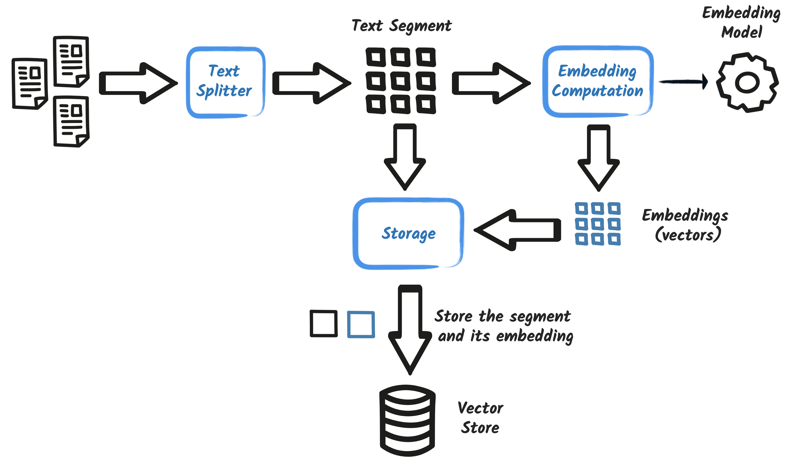
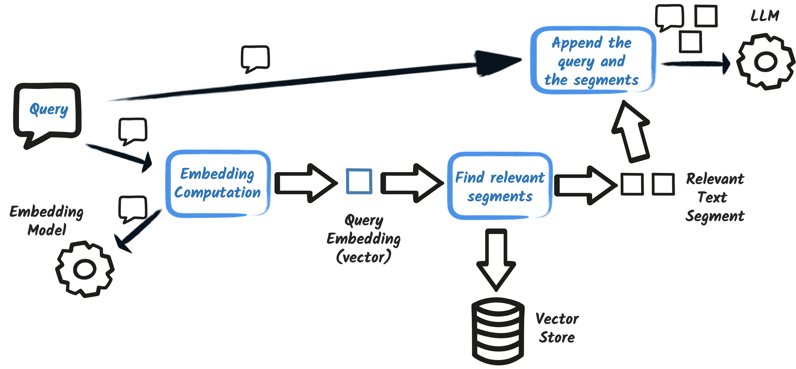
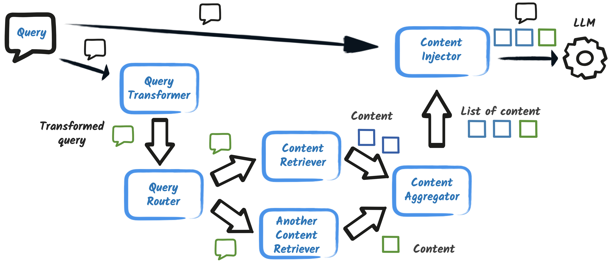

# Document Retrieval for Language Models with PostgreSQL pgVector store

In this exercise, we will explore the **Retrieval Augmented Generation (RAG)** pattern and delve into its underlying mechanisms. We will learn how to customize it by integrating our own knowledge base and embedding model.

## 1. Embedding model

The RAG pattern relies heavily on an embedding model. This model plays a vital role in transforming textual data into numerical vectors. These vectors, in turn, serve as the foundation for comparing different text passages and identifying the most relevant segments.

The choice of embedding model significantly impacts the RAG pattern's effectiveness. While OpenAI provides a default embedding model, you have the flexibility to integrate a custom embedding model that better aligns with your specific data and requirements.

For this exercise, we'll be leveraging the [bge-small-en-q](https://huggingface.co/neuralmagic/bge-small-en-v1.5-quant) embedding model. This model offers a good balance between performance and efficiency.

Open the `pom.xml` file to ensure if the **langchain4j-embeddings-bge-small-en-q** extension is already added to the Quarkus project.

```xml
<dependency>
    <groupId>dev.langchain4j</groupId>
    <artifactId>langchain4j-embeddings-bge-small-en-q</artifactId>
</dependency>
```

This project leverages the **bge-small-en-q** embedding model, which runs locally on your machine. This eliminates the need to send your documents to an external service for vector computation, improving efficiency and potentially reducing costs.

The bge-small-en-q model generates **384-dimensional** vectors. While considered a compact model, it offers sufficient capabilities for our current use case.

Quarkus automatically creates a CDI bean named [dev.langchain4j.model.embedding.onnx.bgesmallenq.BgeSmallEnQuantizedEmbeddingModel](https://github.com/langchain4j/langchain4j-embeddings/blob/main/langchain4j-embeddings-bge-small-en-q/src/main/java/dev/langchain4j/model/embedding/onnx/bgesmallenq/BgeSmallEnQuantizedEmbeddingModel.java). To utilize this bean within your code, simply add the following line to your `src/main/resources/application.properties` file.

```properties
quarkus.langchain4j.embedding-model.provider=dev.langchain4j.model.embedding.onnx.bgesmallenq.BgeSmallEnQuantizedEmbeddingModel
```

## 2. Vector store

Having established our embedding model, we now turn our attention to storing the generated embeddings. While the previous exercise employed an **in-memory** store, we will transition to a more robust and persistent storage mechanism to ensure data retention across application restarts.

A variety of storage solutions can be employed for embeddings, such as [Redis](https://docs.quarkiverse.io/quarkus-langchain4j/dev/redis-store.html), [Infinispan](https://docs.quarkiverse.io/quarkus-langchain4j/dev/infinispan-store.html), and specialized databases like [Chroma](https://docs.quarkiverse.io/quarkus-langchain4j/dev/chroma-store.html). In this exercise, we'll leverage the [PostgreSQL pgVector store](https://docs.quarkiverse.io/quarkus-langchain4j/dev/pgvector-store.html), a widely adopted relational database with robust support for vector data.

Open the `pom.xml` file to ensure if the **langchain4j-pgvector** extension is already added to the Quarkus project.

```xml title="pom.xml"
<dependency>
    <groupId>io.quarkiverse.langchain4j</groupId>
    <artifactId>quarkus-langchain4j-pgvector</artifactId>
</dependency>
```

This embedding store (like many others) needs to know the size of the embeddings that will be stored in advance.

Open the `src/main/resources/application.properties` to ensure if the `quarkus.langchain4j.pgvector.dimension` property is already added to the Quarkus project.

```properties
quarkus.langchain4j.pgvector.dimension=384
```

The value represents the dimensionality of the vectors generated by the **bge-small-en-q** embedding model. With this information, we can now effectively utilize the **io.quarkiverse.langchain4j.pgvector.PgVectorEmbeddingStore** bean for storing and retrieving embeddings.

## 3. Ingesting documents into the vector store

Ensure if the **langchain4j-easy-rag** extension is already added to the `src/main/resources/application.properties` file.

```properties
rag.location=src/main/resources/rag
```

We introduce a custom configuration property, **quarkus.my-app.document-path**, to specify the location of documents for ingestion into the vector store. This property replaces the **quarkus.langchain4j.easy-rag.path** used in the previous exercise.

Next, we'll leaarn how the **Ingestor** is implemented, a crucial component responsible for reading the specified documents and storing their corresponding embeddings within the vector store.



Open the `RagIngestion` file in the `src/main/java/dev/langchain4j/quarkus/workshop` directory to ensure if the class is already implemented with the following content.

```java
package dev.langchain4j.quarkus.workshop;

import static dev.langchain4j.data.document.splitter.DocumentSplitters.recursive;

import java.nio.file.Path;
import java.util.List;

import jakarta.enterprise.context.ApplicationScoped;
import jakarta.enterprise.event.Observes;

import org.eclipse.microprofile.config.inject.ConfigProperty;

import io.quarkus.logging.Log;
import io.quarkus.runtime.StartupEvent;

import dev.langchain4j.data.document.Document;
import dev.langchain4j.data.document.loader.FileSystemDocumentLoader;
import dev.langchain4j.model.embedding.EmbeddingModel;
import dev.langchain4j.store.embedding.EmbeddingStore;
import dev.langchain4j.store.embedding.EmbeddingStoreIngestor;

@ApplicationScoped
public class RagIngestion {

    /**
     * Ingests the documents from the given location into the embedding store.
     *
     * @param ev             the startup event to trigger the ingestion when the application starts
     * @param store          the embedding store the embedding store (PostGreSQL in our case)
     * @param embeddingModel the embedding model to use for the embedding (BGE-Small-EN-Quantized in our case)
     * @param documents      the location of the documents to ingest
     */
    public void ingest(@Observes StartupEvent ev,
                       EmbeddingStore store, EmbeddingModel embeddingModel,
                       @ConfigProperty(name = "rag.location") Path documents) {
        store.removeAll(); // cleanup the store to start fresh (just for demo purposes)
        List<Document> list = FileSystemDocumentLoader.loadDocumentsRecursively(documents);
        EmbeddingStoreIngestor ingestor = EmbeddingStoreIngestor.builder()
                .embeddingStore(store)
                .embeddingModel(embeddingModel)
                .documentSplitter(recursive(100, 25))
                .build();
        ingestor.ingest(list);
        Log.info("Documents ingested successfully");
    }

}
```

The **Ingestor** class ingests documents from the location specified by the **rag.location** configuration property and stores their embeddings within the vector store.

This class is triggered during application startup due to the [@Observes StartupEvent ev](https://quarkus.io/guides/lifecycle#listening-for-startup-and-shutdown-events) parameter.

It leverages the following dependencies:

- **PgVectorEmbeddingStore** bean: For storing the generated embeddings.
- **BgeSmallEnQuantizedEmbeddingModel** bean: For generating embeddings from the documents.
- **rag.location** configuration property: For knowing where the documents are.

The **FileSystemDocumentLoader.loadDocumentsRecursively(documents)** method is responsible for retrieving documents from the specified location.

The **EmbeddingStoreIngestor** class is pivotal to the ingestion process, responsible for populating the vector store with document embeddings. Proper configuration of this class is critical to ensure the accuracy and effectiveness of the subsequent Retrieval Augmented Generation (RAG) process.

The choice of document splitter, segment size, and overlap significantly impacts the accuracy of the RAG pattern. These parameters are highly dependent on the nature of your documents and the specific use case. Finding the optimal configuration often requires experimentation. There is no one-size-fits-all solution.

Finally, we initiate the ingestion process and log a message upon its successful completion.

## 4. Retriever and Augmentor

With the documents now ingested into the vector store, we proceed to implement the retriever and augmentor components. The retriever is tasked with identifying the most relevant document segments for a given query. Subsequently, the augmentor extends the initial prompt with these retrieved segments.



Open the `RagRetriever` file in the `src/main/java/dev/langchain4j/quarkus/workshop` directory to ensure if the class with the following content.

```java
package dev.langchain4j.quarkus.workshop;

import java.util.List;

import jakarta.enterprise.context.ApplicationScoped;
import jakarta.enterprise.inject.Produces;

import dev.langchain4j.data.message.UserMessage;
import dev.langchain4j.model.embedding.EmbeddingModel;
import dev.langchain4j.rag.DefaultRetrievalAugmentor;
import dev.langchain4j.rag.RetrievalAugmentor;
import dev.langchain4j.rag.content.Content;
import dev.langchain4j.rag.content.injector.ContentInjector;
import dev.langchain4j.rag.content.retriever.EmbeddingStoreContentRetriever;
import dev.langchain4j.store.embedding.EmbeddingStore;

public class RagRetriever {

    @Produces
    @ApplicationScoped
    public RetrievalAugmentor create(EmbeddingStore store, EmbeddingModel model) {
        var contentRetriever = EmbeddingStoreContentRetriever.builder()
                .embeddingModel(model)
                .embeddingStore(store)
                .maxResults(3)
                .build();

        return DefaultRetrievalAugmentor.builder()
                .contentRetriever(contentRetriever)
                .build();
    }
}
```

The **create** method orchestrates both the retrieval of relevant documents and the augmentation of the user's prompt. It leverages the **PgVectorEmbeddingStore** bean to efficiently retrieve embeddings from the vector database and utilizes the **BgeSmallEnQuantizedEmbeddingModel** bean to generate embeddings for the user's query and the retrieved documents.

To ensure optimal performance within the RAG system, it's paramount to utilize the same embedding model for both the document ingestion phase and the query embedding process.

If different embedding models are employed, the generated embeddings will not be compatible. This inconsistency will result in inaccurate similarity calculations and hinder the retriever's ability to effectively identify relevant document segments.

The **EmbeddingStoreContentRetriever** class is responsible for identifying the most relevant document segments within the vector store.

### Important Note:

- It is crucial to utilize the same embedding model for both the document ingestion process and the query embedding process.
- Inconsistency in embedding models will lead to incompatible embeddings, hindering the retriever's ability to accurately identify relevant segments.

The content retriever offers flexibility through configurable options, such as filters applied to segment metadata and minimum score thresholds.

Building upon this, we can now construct the prompt augmentation mechanism by creating a **DefaultRetrievalAugmentor** that utilizes the configured content retriever.

1. Retrieve the most relevant document segments for the given query using the content retriever.
2. Augment the original query by incorporating the retrieved segments.

The DefaultRetrievalAugmentor offers advanced customization options, including methods for modifying the prompt, integrating multiple retrievers, and more. For the sake of simplicity, we will focus on a basic configuration in this example.

## 5. Testing the application

Note that you need to set the environment variable `OPENAI_API_KEY` with your OpenAI API key.

```shell
export OPENAI_API_KEY="YOUR_OPENAI_API_KEY"
```

Run the application with the following command:

```shell
./mvnw quarkus:dev
```

**Note:** You may get a `mvnw permission issue` error. If you run into an error about the `mvnw` maven wrapper, you can give execution permission for the file by navigating to the project folder and executing `chmod +x mvnw`.

**Note:** You may get the error, `Could not expand value OPENAI_API_KEY`. If you run into an error indicating `java.util.NoSuchElementException: SRCFG00011: Could not expand value OPENAI_API_KEY in property quarkus.langchain4j.openai.api-key`, make sure you have set the environment variable `OPENAI_API_KEY` with your OpenAI API key.

**Note:** this application relies on either **Podman** or **Docker** to automatically start a PostgreSQL database instance. Ensure that you have one of these containerization tools installed and running on your system.

Upon application startup, the documents will be automatically ingested into the vector store. To verify successful ingestion, you can utilize the dev UI as demonstrated in the previous exercise. However, in this exercise, we will proceed to test the application's functionality using the chatbot itself.

Access the [Chatbot homepage](http://localhost:8080).

Interact with the Gen AI Chatbot by asking a question. Assess whether the chatbot successfully retrieves relevant segments and provides a well-structured and informative response.

```shell
What can you tell me about your cancellation policy?
```

## 6. Advanced RAG

This exercise has provided a foundational understanding of the Retrieval Augmented Generation (RAG) pattern. However, it's important to recognize that the RAG pattern encompasses a much broader spectrum of possibilities.

- **Customization**: The RAG framework offers significant flexibility. You can experiment with different embedding models, explore diverse vector store options, and implement various retrieval strategies.
- **Extensibility**: The retrieval and augmentation processes themselves can be further refined and extended to enhance the overall performance and capabilities of the RAG system.



The RAG pattern offers significant flexibility. For instance, you can utilize multiple retrievers, implement filters, and establish minimum score thresholds for retrieved segments. When employing multiple retrievers, various strategies can be employed to combine or prioritize their results.

To illustrate these possibilities, we will now customize the content injector. This component determines how retrieved segments are incorporated into the prompt. Currently, the prompt typically follows a structure similar to the following:

```text

<user query>
Answer using the following information:
<segment 1>
<segment 2>
<segment 3>
```

We will now modify the existing configuration to:

```text
<user query>
Please, only use the following information:

- <segment 1>
- <segment 2>
- <segment 3>
```

Update the **RagRetriever** class by modifying the **create**.

```java
package dev.langchain4j.quarkus.workshop;

import java.util.List;

import jakarta.enterprise.context.ApplicationScoped;
import jakarta.enterprise.inject.Produces;

import dev.langchain4j.data.message.UserMessage;
import dev.langchain4j.model.embedding.EmbeddingModel;
import dev.langchain4j.rag.DefaultRetrievalAugmentor;
import dev.langchain4j.rag.RetrievalAugmentor;
import dev.langchain4j.rag.content.Content;
import dev.langchain4j.rag.content.injector.ContentInjector;
import dev.langchain4j.rag.content.retriever.EmbeddingStoreContentRetriever;
import dev.langchain4j.store.embedding.EmbeddingStore;

public class RagRetriever {

    @Produces
    @ApplicationScoped
    public RetrievalAugmentor create(EmbeddingStore store, EmbeddingModel model) {
        var contentRetriever = EmbeddingStoreContentRetriever.builder()
                .embeddingModel(model)
                .embeddingStore(store)
                .maxResults(3)
                .build();

        return DefaultRetrievalAugmentor.builder()
                .contentRetriever(contentRetriever)
                .contentInjector(new ContentInjector() {
                    @Override
                    public UserMessage inject(List<Content> list, UserMessage userMessage) {
                        StringBuffer prompt = new StringBuffer(userMessage.singleText());
                        prompt.append("\nPlease, only use the following information:\n");
                        list.forEach(content -> prompt.append("- ").append(content.textSegment().text()).append("\n"));
                        return new UserMessage(prompt.toString());
                    }
                })
                .build();
    }
}
```

To see the effect of this change, ask a question to the chatbot. The latest logs will display the modified prompt that was used to generate the chatbot's response.

```shell
INFO  [io.qua.lan.ope.OpenAiRestApi$OpenAiClientLogger] (vert.x-eventloop-thread-0) Request:
- method: POST
- url: https://api.openai.com/v1/chat/completions
- headers: [Accept: text/event-stream], [Authorization: Be...1f], [Content-Type: application/json], [User-Agent: langchain4j-openai], [content-length: 886]
- body: {
  "model" : "gpt-4o",
  "messages" : [ {
    "role" : "system",
    "content" : "You are a customer support agent of a car rental company 'Miles of Smiles'.\nYou are friendly, polite and concise.\nIf the question is unrelated to car rental, you should politely redirect the customer to the right department.\n"
  }, {
    "role" : "user",
    "content" : "What can you tell me about your cancellation policy?\nPlease, only use the following information:\n- 4. Cancellation Policy\n- 4. Cancellation Policy 4.1 Reservations can be cancelled up to 11 days prior to the start of the\n- booking period.\n4.2 If the booking period is less than 4 days, cancellations are not permitted.\n"
  } ],
  "temperature" : 0.3,
  "top_p" : 1.0,
  "stream" : true,
  "stream_options" : {
    "include_usage" : true
  },
  "max_tokens" : 1000,
  "presence_penalty" : 0.0,
  "frequency_penalty" : 0.0
}
```

This injector example, while basic, serves as a valuable learning experience. It demonstrates the potential for customization within the RAG framework, allowing you to explore and experiment with different approaches to enhance its performance for your specific use cases.

## 7. Conclusion

Stop the Quarkus dev mode by pressing **Ctrl + C**. 

In this exercise, we successfully deconstructed the RAG pattern. We implemented a practical example utilizing our own embedding model and vector store. This hands-on experience provided valuable insights into the various aspects of the RAG process and demonstrated the flexibility for customization.

If you have any questions or need further assistance, please don't hesitate to reach out to [Quarkus community](https://quarkus.io/support/). Let's continue to build great applications with Quarkus and LangChain4j!